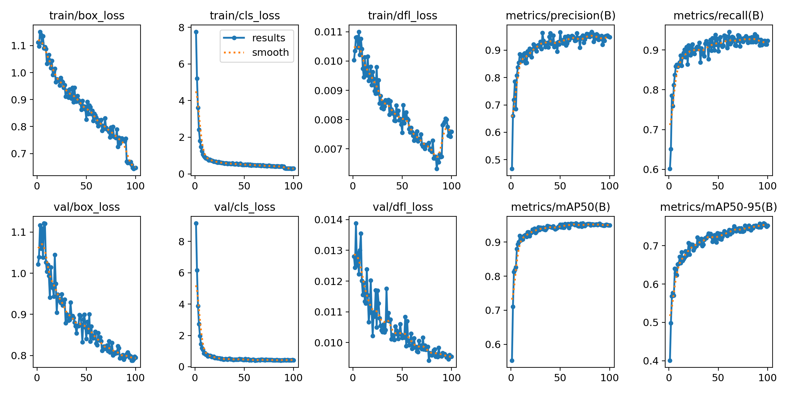
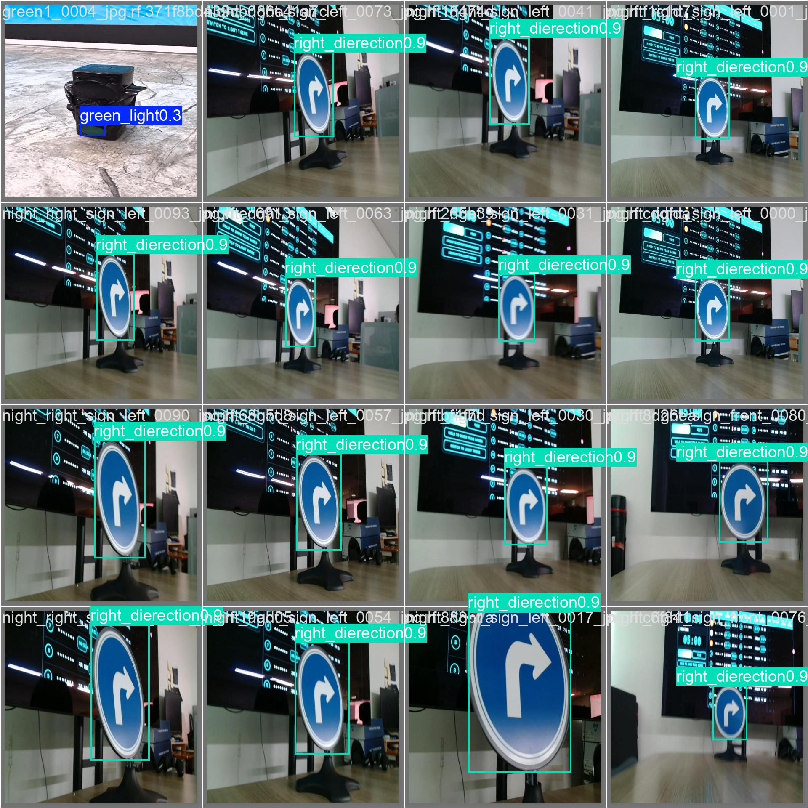

# D-Racer YOLO: Traffic Light & Direction Sign Detector

Object detector for **D-Racer**, the autonomous RC car my team (Team W2G) built for the **2026 SEA:ME Hackathon** (July 2026).
It detects traffic lights and direction signs on the track so the car can decide when to start, stop and which way to turn.

The model is a YOLO26n network fine-tuned on a custom dataset. It is exported to ONNX for CPU inference on the car's embedded board, a TOPST D3-G running Ubuntu 22.04 and ROS 2 Humble.

## Classes

| ID | Class | Used for |
| -- | ----- | -------- |
| 0 | `green_light` | Start / go |
| 1 | `left_direction` | Turn left at the junction |
| 2 | `red_light` | Stop |
| 3 | `right_dierection` | Turn right at the junction (label typo kept for compatibility with trained weights) |

## Dataset

Images of the hackathon track's traffic lights and signs, labeled and managed on [Roboflow](https://universe.roboflow.com/seunghoons-workspace-kdhat/my-first-project-tmo1a) (CC BY 4.0).

| Split | Images |
| ----- | -----: |
| Train | 1,324 |
| Valid | 376 |
| Test | 188 |

## Training

| Setting | Value |
| ------- | ----- |
| Base model | `yolo26n.pt` |
| Epochs | 100 |
| Image size | 640 |
| Batch | 8 |
| GPU | NVIDIA RTX 5060 Laptop (8 GB) |

```bash
pip install ultralytics
yolo detect train model=yolo26n.pt data=dataset/data.yaml epochs=100 imgsz=640 batch=8
```

## Results

Validation results of the final model (`runs/detect/train-3`, epoch 100):

| Precision | Recall | mAP@50 | mAP@50-95 |
| --------: | -----: | -----: | --------: |
| 0.948 | 0.923 | 0.950 | 0.752 |





## Deployment

The best weights are exported to ONNX (`runs/detect/train-3/weights/best.onnx`) and run on the D3-G board's CPU inside a ROS 2 node.

```bash
yolo export model=runs/detect/train-3/weights/best.pt format=onnx
```

During the hackathon, a red-light false positive once stopped the car mid-run. I retrained the detector to fix it, which is why there are several training runs.

## Repository structure

```
dataset/            Roboflow export (train / valid / test, YOLO format)
runs/detect/train*  Training runs (curves, confusion matrices, weights)
runs/detect/predict Sample predictions
yolo26n.pt          Pretrained base weights
```
